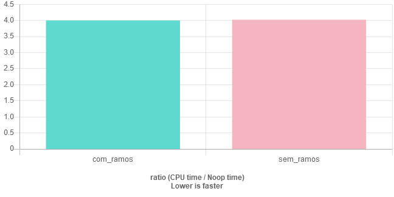
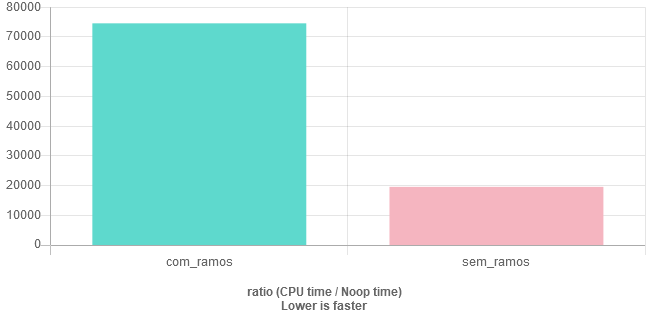

# Programação sem IF e ELSE?

<!-- subtítulo: Não tente isso na produção -->
<!-- subtítulo: Tente com a supervisão de um adulto -->

Já pensou escrever um programa inteiro sem `if`s ou `else`s ? Provavelmente não, mas isso não significa que não podemos fazer lógica sem eles, e as vezes bem mais rápido do que com.

O nome desse tipo de programação é `branchless programming`, programação sem ramos, já que não usa `if`, que criaria ramos de execução pro código.

Por que isso seria útil? No seu caso, provavelmente, só serviria para satisfazer a curiosidade. Mas em casos específicos, como código criptográfico, esse tipo de programação é absolutamente requerido já que a existência de 2 possíveis caminhos poderia resultar em tempos de execução diferentes para determinadas entradas o que, por sua vez, poderia causar o vazamento de informação sigilosa. Nesse caso programação `branchless` é usada como **medida de segurança**!

Outro uso legitimo é em determinados algoritmos de baixo nível que não podem desperdiçar o tempo que o `if` custa, dessa forma `branchless` teoricamente serve para deixar o programa **bem** mais rápido. Mas preste bastante atenção se quiser usá-lo para aumentar a performance: seu compilador é muito mais esperto que você, grandes são as chances que ao aplicar esse tipo de programação, ao invés de deixar seu programa mais rápido você vai torná-lo mais devagar ou não vai alterar a performance em nada. Lembre-se: Otimização prematura é a raiz de todo o mal (David Knuth). Então como saber se posso usar programação `branchless` para acelerar meu algoritmo? O melhor jeito é programar dos dois jeitos e medir a performance deles em uma situação parecida com à que vão ser usados. Por outro lado, para evitar todo esse trabalho, entender o porquê do `if` ser considerado tão devagar pode te ajudar a determinar se ele é um possível problema, se sim, aí você pode colocar a mão na massa e medir se o `branchless` vai te ajudar mesmo.

### Por que o if é tão devagar?

As CPUs modernas tem alta capacidade de paralelização, isto é, ao invés de executar uma instrução de cada vez, elas pegam as próximas linhas de código e decidem o que podem fazer ao mesmo tempo sem interferir no resultado final, aí fazem isso. Para que esse tipo de paralelização seja mais efetiva o caminho de código tem que ser o mais único (sem ramos) quanto possível. Mas como sabemos, não é assim que a maior parte de código é, tem if daqui, else de lá, switch dentro de loop e assim vai. Sabendo disso, os desenvolvedores de processadores criaram outro mecanismo para auxiliar o primeiro: o *branch predictor*, prevedor de ramos, que tem a capacidade de prever qual dos ramos vai ser tomado, antes mesmo de computar o resultado. Eles são excelentes, de verdade, com uma precisão de uns 95%, mas não são perfeitos. Assim, quando eles acertam o `if` tem um custo quase zero na execução, porém, quando erram ihh...

Já que o prevedor de ramos é a base pro funcionamento da execução paralela da CPU, quando ele erra todo o trabalho feito pelo outro ramo durante a paralelização tem que ser desfeito, as instruções certas tem que ser buscadas, para aí sim o ramo certo ser executado. Como eu disse, isso quase não acontece, já que o prevedor de ramos é muito bom, mas existem certos algoritmos que dificultam muito o trabalho dele. Por exemplo, uma função `min(a, b)` que determina qual o menor número entre `a` e `b` normalmente vai ser usada em números que tem 50% de probabilidade de cada um ser o maior.

```cpp
// A vai ser menor cerca de metade das vezes
int min(int a, int b) {
	if (a < b)
		return a;
	else
		return b;
}
```

Nesse caso, o prevedor de ramos não faz ideia de o que fazer e vai errar metade das vezes, o que resultaria em muito tempo gasto. Esse caso levantaria a suspeita de que uma abordagem `branchless` poderia aumentar a performance.

### Aplicando programação branchless

A programação sem ramos tem como base o fato de que o computador representa valores verdadeiros e falsos com os números 1 e 0, o que permite aplicarmos aritimética à eles. Dessa forma se temos dois possíveis cálculos à fazer e precisamos decidir entre eles com base em alguma condição, ao invés de usarmos

```
if (condicao):
	calculo1()
else:
	calculo2()
```

Uma abordagem branchless seria

```
calculo1()*condicao + calculo2()*(!condicao)
```

Ou seja, você multiplica o primeiro cálculo pela condição e o segundo cálculo pelo inverso da condição e soma. Isso funciona por que multiplicação por verdadeiro (um) resulta no próprio cálculo, ou seja, mantém ele e multiplicação por falso (zero) resulta em zero, ou seja, descarta o cálculo.

Se aplicarmos à função `min()` de antes, ela poderia ser assim:

```cpp
// A vai ser menor cerca de metade das vezes
int min(int a, int b) {
	return a * (a < b) + b * !(a < b);
}
```

Legal, conseguimos deixar bem pior de entender o que ela faz, agora se deixamos mais rápido mesmo só vamos saber se medirmos a performance. Não vou entrar à fundo nisso aqui, mas os resultados em uma compilação otimizada (O3) são esses:



***Como assim?? Achei que programação sem ramos era pra ser mais rápida!***

Pois é, como eu disse antes: seu compilador é muito esperto. Ele conseguiu perceber nos dois casos o que estávamos tentando fazer (retornar o menor dentre dois números) e disse "Opa, eu sei um jeito mais rápido de fazer isso", aí ambos foram compilados para *exatamente* o mesmo código de máquina. Se você não acredita, pode tentar repetir o benchmark. Esse é o [link](https://www.quick-bench.com/q/vlPZrMDjzshohwwLVVFoV-fVph) e tá aqui o código:

```cpp
// A vai ser menor cerca de metade das vezes
int min_com_ramos(int a, int b) {
	if (a < b)
		return a;
	else
		return b;
}

// A vai ser menor cerca de metade das vezes
int min_sem_ramos(int a, int b) {
	return a * (a < b) + b * !(a < b);
}

static void com_ramos(benchmark::State& state) {
  int i = 0;
  for (auto _ : state) {
    ++i;
    int a = i;
    int b = a + (i%2)*(-2) + 1;

    int res = min_com_ramos(a, b);
    benchmark::DoNotOptimize(res);
  }
}
BENCHMARK(com_ramos);

static void sem_ramos(benchmark::State& state) {
  int i = 0;
  for (auto _ : state) {
    ++i;
    int a = i;
    int b = a + (i%2)*(-2) + 1;

    int res = min_sem_ramos(a, b);
    benchmark::DoNotOptimize(res);
  }
}
BENCHMARK(sem_ramos);
```


Os casos que branchless realmente leva à algum ganho na performance são muito específicos. O melhor mesmo, ainda mais se você for iniciante, é confiar que seu compilador vai fazer essas micro otimizações por você e se concentrar em usar as melhores estruturas de dados e algorítimos para cada ocasião e tentar usar algo como [design orientado à dados](https://moskoscode.com/o-super-veloz-design-orientado-a-dados/) quando possível.

Com esses avisos fora do caminho, vamos ver um caso muito legal que programação branchless realmente consegue aumentar a performance!

Você já digitou seu nome de usuário em algum site, mas incomodamente ele não conseguiu identificar por que você colocou alguma letra maiúscula? Um saco né? A função que vamos fazer poderia ter sido usada para evitar esse erro. É uma função `para_minuscula(char* str)` que transforma letras maiúsculas em minúsculas sem afetar o restante dos caracteres. O jeito mais simples de implementar isso provavelmente seria assim:

```cpp
void para_minusculas(char* texto) {
	// Faça até chegarmos no fim da string
    for (; *texto != '\0'; ++texto) {
    	// Se o caractere for uma letra maiúscula
        if (*texto >= 'A' && *texto <='Z') {
        	// Transforme ela em minúscula
            *texto += 'a' - 'A';
        }
    }
}
```

Como você pode ver temos um ramos que opera se o caractere for uma letra maiúscula, outro quando não for. Se qualquer caractere do ASCII for considerado uma entrada válida, a probabilidade de cada ramo é de aproximadamente 20% para letras maiúsculas e 80% para outros, uma chance baixa de acerto para o prevedor de ramos. Ao mesmo tempo também parece ser uma função complexa o suficiente para que o compilador não consiga otimizar totalmente. Uma ótima candidata para tentarmos aplicar programação branchless. Ficaria assim:

```cpp
void para_minusculas(char* texto) {
	// Faça até chegarmos no fim da string
    for (; *texto != '\0'; ++texto) {
        // se for uma letra maiúscula transforme-a em minúscula
        *texto += ( (*texto >= 'A' && *texto <='Z') * ('a' - 'A') );
    }
}
```

E agora, rufem os tambores....




Quase 4x mais rápido do que a versão com ramos, isso que é um raminho de nada, imagina se fosse algo super rebuscado.

